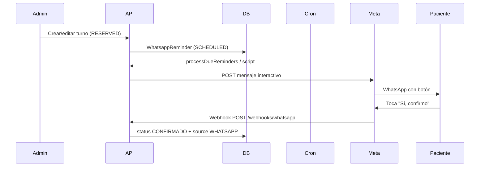

# Recordatorios y confirmación por WhatsApp (Meta Business)

## Objetivo

Enviar recordatorios automáticos a pacientes con turno en estado **Agendado** (`RESERVED`) y permitir confirmar con **un solo toque** en WhatsApp. Al confirmar, el turno pasa a **Confirmado** (`CONFIRMADO`) con origen `WHATSAPP`.

## Reglas de envío

| Situación | Comportamiento |
|-----------|----------------|
| Turno a **≥ 24 h** | Mensaje programado para **24 h antes** del inicio (`STANDARD_24H`). |
| Turno a **< 24 h** | **Confirmación inmediata** (`SHORT_NOTICE`): se envía unos minutos después de agendar (por defecto 5 min, configurable). Texto aclara que el turno es pronto y pide confirmar asistencia. |
| Sin teléfono del paciente | No se programa envío. |
| Turno ya pasó o en curso | No se programa / se omite al procesar. |
| Estado distinto de Agendado | Se cancelan recordatorios pendientes. |

## Mensaje al paciente

Incluye:

- Nombre del centro (`CLINIC_NAME`)
- Dirección (`CLINIC_ADDRESS` — hoy valor genérico, actualizar en `.env`)
- Nombre del paciente
- Fecha y horario
- Especialista
- Consultorio

**Un solo botón interactivo:** `Sí, confirmo` (Meta: mensaje tipo *button* con una reply).

Ejemplo (turno estándar):

```
Hola María, te recordamos tu turno en *LogoCen*:

📍 *LogoCen*
Av. Corrientes 1234, CABA

📅 martes 20 de mayo de 2026
🕐 10:00 a 11:00 hs
👨‍⚕️ Pérez, Juan
🏥 Consultorio 2

Tocá el botón para confirmar tu asistencia.

[ Sí, confirmo ]
```

Ejemplo (turno con menos de 24 h):

```
Hola María, tu turno en *LogoCen* es en menos de 24 horas.
Necesitamos que confirmes si vas a asistir.
...
```

## Flujo técnico



## Configuración Meta (resumen)

1. Cuenta **Meta Business** + app en [developers.facebook.com](https://developers.facebook.com).
2. Producto **WhatsApp** → número de prueba o producción.
3. Token de acceso y **Phone number ID**.
4. Webhook:
   - URL: `https://tu-dominio/webhooks/whatsapp`
   - Verify token: mismo valor que `WHATSAPP_VERIFY_TOKEN`
   - Suscripción: `messages`
5. `WHATSAPP_APP_SECRET` para validar firma `X-Hub-Signature-256`.

Variables en `backend/.env` (ver `.env.example`).

## Plantillas Meta

| Nombre | Uso |
|--------|-----|
| **`recordatorio_turno_v3`** | **Activa en LogoCen** — iconos, turno &lt;24 h, 6 variables |
| `recordatorio_turno` | Versión simple (legacy), 6 variables |
| `recordatorio_turno_v2` | Con dirección en {{7}} (7 variables) |

### `recordatorio_turno_v3` (aprobada)

**Cuerpo en Meta:**

```
Hola {{1}}, tu turno en *{{2}}* es en menos de 24hs. Necesitamos que nos confirmes si vas a asistir.

📅 {{3}}
🕐 {{4}}
🧑‍⚕️ {{5}}
📍 {{6}}

Confirmá con el botón.
```

**Footer:** `Muchas Gracias` (fijo en la plantilla, no se envía desde el código)

**Botón:** respuesta rápida **Sí, confirmo**

**Mapeo en LogoCen:**

| Var | Contenido |
|-----|-----------|
| {{1}} | Nombre del paciente |
| {{2}} | `CLINIC_NAME` |
| {{3}} | Fecha (es-AR) |
| {{4}} | Hora de inicio (`startTime`, ej. `10:00`) |
| {{5}} | Profesional |
| {{6}} | Solo `CLINIC_ADDRESS` |

**`.env`:**

```env
WHATSAPP_REMINDER_TEMPLATE_NAME=recordatorio_turno_v3
WHATSAPP_REMINDER_TEMPLATE_LANGUAGE=es_AR
CLINIC_NAME="LogoCen"
CLINIC_ADDRESS="Calle 520 N°11323"
```

**Nota:** el texto «menos de 24 hs» encaja con recordatorios **SHORT_NOTICE** (&lt;24 h al agendar). Turnos con aviso **24 h antes** (`STANDARD_24H`) siguen usando **mensaje interactivo** (sin plantilla v3) hasta tener otra plantilla para ese caso.

### Plantillas anteriores (referencia)

En **WhatsApp Manager → Plantillas → Crear**:

- **Nombre:** `recordatorio_turno_v2`
- **Categoría:** Utilidad
- **Idioma:** Español (Argentina) `es_AR`
- **Tipo de variable:** Posicional
- **Título:** vacío (no usar `{{}}`)

**Cuerpo** (copiar tal cual — formato validado por Meta):

```
Hola {{1}}, recordatorio de turno en {{2}}.

📍 Dirección: {{7}}

📅 Fecha: {{3}}
🕐 Horario: {{4}}
Profesional: {{5}}
Consultorio: {{6}}

Confirmá con el botón.
```

**Ejemplos** (al pedir revisión, uno por variable):

| Var | Ejemplo |
|-----|---------|
| {{1}} | Juan |
| {{2}} | LogoCen |
| {{3}} | martes 20 de mayo de 2026 |
| {{4}} | 10:00 a 11:00 hs |
| {{5}} | Pérez, Juan |
| {{6}} | Consultorio 2 |
| {{7}} | Calle 520 N°11323 |

**Errores frecuentes en Meta:** línea que es solo `{{7}}`; repetir `{{2}}` en otra línea; emojis compuestos (👨‍⚕️); título con `{{}}`; variables tipo «Nombre» en lugar de **Posicional**.

**Botón:** Respuesta rápida — texto **Sí, confirmo**

Cuando esté **Activa**, en `.env`:

```env
WHATSAPP_REMINDER_TEMPLATE_NAME=recordatorio_turno_v2
WHATSAPP_REMINDER_TEMPLATE_LANGUAGE=es_AR
CLINIC_ADDRESS="Calle 520 N°11323"
```

Reiniciar backend. El código envía automáticamente la variable `{{7}}` desde `CLINIC_ADDRESS`.

## Ejecución del cron

Cada **5–10 minutos** (recomendado):

```bash
# Opción A: script local / servidor
cd backend && npm run whatsapp:reminders

# Opción B: HTTP (con CRON_SECRET)
curl -X POST https://api.tudominio.com/api/internal/whatsapp/reminders/run \
  -H "X-Cron-Secret: tu-secreto"
```

Diagnóstico local:

```bash
cd backend && npm run whatsapp:errors          # últimos fallos de envío
cd backend && npm run whatsapp:check-webhook   # token + phone number ID
```

## Archivos principales

| Ruta | Rol |
|------|-----|
| `backend/prisma/schema.prisma` | Modelo `WhatsappReminder` |
| `backend/src/whatsapp/reminderSchedule.ts` | Lógica 24 h vs corto plazo |
| `backend/src/whatsapp/messageBuilder.ts` | Texto y ID del botón |
| `backend/src/whatsapp/metaClient.ts` | Envío a Graph API |
| `backend/src/services/whatsappReminder.service.ts` | Programar, enviar, confirmar |
| `backend/src/services/whatsappWebhook.service.ts` | Webhook entrante |
| `backend/src/routes/whatsapp.webhook.routes.ts` | GET verify + POST eventos |

## Turnos fijos

La estructura soporta IDs `fixed:{seriesId}:{fecha}` en recordatorios y en la respuesta del botón. La programación automática al crear series fijas puede agregarse en una siguiente iteración (hoy: turnos puntuales al crear/editar cita).

## Próximos pasos (roadmap)

### Ya listo en test
- Envío con plantilla + confirmación por botón / CONFIRMO
- Agenda con estado Confirmado

### Ahora (mejorar mensaje)
1. Crear plantilla **`recordatorio_turno_v2`** con iconos (ver arriba)
2. Esperar aprobación Meta → cambiar `WHATSAPP_REMINDER_TEMPLATE_NAME`
3. Verificar dirección real en `CLINIC_ADDRESS`

### Antes de producción real
1. **App Meta en modo Live** (revisión de app si Meta la pide)
2. **Número WhatsApp real** de LogoCen (no el de prueba +1 555…)
3. **Token permanente** (usuario del sistema en Business Manager)
4. **Webhook en URL fija** (dominio producción, sin ngrok)
5. **Cron en servidor** cada 5–10 min (`whatsapp:reminders` o endpoint interno)
6. Pacientes con teléfono válido (validación ya en formularios)

### Opcional después
- Recordatorios para turnos fijos
- Panel admin: estado del recordatorio (enviado / fallido)
- Aviso al admin si no confirma X h antes del turno
