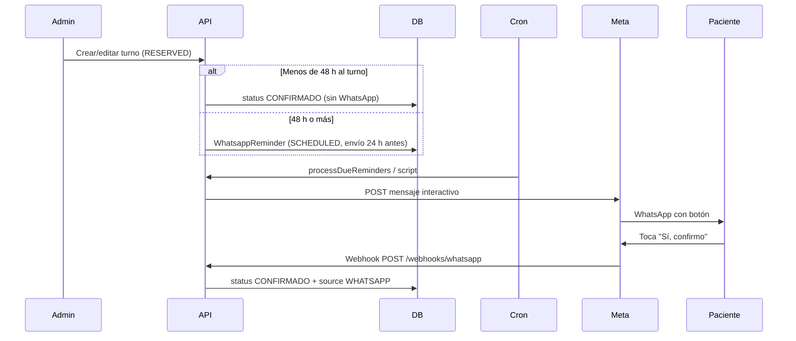

# Recordatorios y confirmación por WhatsApp (Meta Business)

## Objetivo

Enviar recordatorios automáticos a pacientes con turno en estado **Agendado** (`RESERVED`) y permitir confirmar con **un solo toque** en WhatsApp. Al confirmar, el turno pasa a **Confirmado** (`CONFIRMADO`) con origen `WHATSAPP`.

## Reglas de envío

| Situación | Comportamiento |
|-----------|----------------|
| Turno a **≥ 48 h** del inicio | WhatsApp programado para **24 h antes** del turno (`STANDARD_24H`). El paciente confirma con el botón. |
| Turno a **< 48 h** del inicio | **Sin WhatsApp.** Al crear o editar, el turno pasa directo a **Confirmado** (`CONFIRMADO`, origen manual). |
| Sin teléfono del paciente (≥ 48 h) | No se programa envío; el turno sigue **Agendado** hasta confirmación manual. |
| Turno ya pasó o en curso | No se programa / se omite al procesar. |
| Estado distinto de Agendado | Se cancelan recordatorios pendientes. |

## Mensaje al paciente

Incluye:

- Nombre del centro (`CLINIC_NAME`)
- Dirección (`CLINIC_ADDRESS` — hoy valor genérico, actualizar en `.env`)
- Nombre del paciente
- Fecha y horario
- Especialista
- Consultorio

**Un solo botón interactivo:** `Sí, confirmo` (Meta: mensaje tipo *button* con una reply).

Ejemplo (turno estándar):

```
Hola María, te recordamos tu turno en *LogoCen*:

📍 *LogoCen*
Av. Corrientes 1234, CABA

📅 martes 20 de mayo de 2026
🕐 10:00 a 11:00 hs
👨‍⚕️ Pérez, Juan
🏥 Consultorio 2

Tocá el botón para confirmar tu asistencia.

[ Sí, confirmo ]
```

Los turnos con **menos de 48 h** de anticipación **no reciben** este mensaje; quedan confirmados en la agenda sin pasar por WhatsApp.

## Flujo técnico



## Configuración Meta (resumen)

1. Cuenta **Meta Business** + app en [developers.facebook.com](https://developers.facebook.com).
2. Producto **WhatsApp** → número de prueba o producción.
3. Token de acceso y **Phone number ID**.
4. Webhook:
   - URL: `https://tu-dominio/webhooks/whatsapp`
   - Verify token: mismo valor que `WHATSAPP_VERIFY_TOKEN`
   - Suscripción: `messages`
5. `WHATSAPP_APP_SECRET` para validar firma `X-Hub-Signature-256`.

Variables en `backend/.env` (ver `.env.example`).

## Plantillas Meta

| Nombre | Uso |
|--------|-----|
| **`recordatorio_turno_24h`** | **En uso ahora** — aviso 24 h antes, **6 variables** (aprobada) |
| `recordatorio_turno_24h_contact` | Futura — misma + {{7}} enlace wa.me al centro |
| `recordatorio_turno_v3` | Legacy (corto plazo); ya no se programa desde LogoCen |
| `recordatorio_turno` | Versión simple (legacy), 6 variables |
| `recordatorio_turno_v2` | Con dirección en {{7}} (7 variables) |

**`.env` recomendado (producción con ambas plantillas):**

```env
WHATSAPP_REMINDER_TEMPLATE_NAME=recordatorio_turno_v3
WHATSAPP_REMINDER_TEMPLATE_24H_NAME=recordatorio_turno_24h
WHATSAPP_REMINDER_TEMPLATE_LANGUAGE=es_AR
CLINIC_NAME="LogoCen"
CLINIC_ADDRESS="Calle 520 N°11323"
CLINIC_CONTACT_PHONE="11 4154-0215"
```

`CLINIC_CONTACT_PHONE` es el **WhatsApp o teléfono actual del cliente** (atención humana). El número de la API solo envía recordatorios; los pacientes usan el enlace `wa.me` de esta variable para consultas.

Si `WHATSAPP_REMINDER_TEMPLATE_24H_NAME` está vacío, los turnos **STANDARD_24H** usan mensaje **interactivo** (funciona en prueba, no ideal en producción).

### `recordatorio_turno_v3` (aprobada)

**Cuerpo en Meta:**

```
Hola {{1}}, tu turno en *{{2}}* es en menos de 24hs. Necesitamos que nos confirmes si vas a asistir.

📅 {{3}}
🕐 {{4}}
🧑‍⚕️ {{5}}
📍 {{6}}

Confirmá con el botón.
```

**Footer:** `Muchas Gracias` (fijo en la plantilla, no se envía desde el código)

**Botón:** respuesta rápida **Sí, confirmo**

**Mapeo en LogoCen:**

| Var | Contenido |
|-----|-----------|
| {{1}} | Nombre del paciente |
| {{2}} | `CLINIC_NAME` |
| {{3}} | Fecha (es-AR) |
| {{4}} | Hora de inicio (`startTime`, ej. `10:00`) |
| {{5}} | Profesional |
| {{6}} | Solo `CLINIC_ADDRESS` |

**`.env`:**

```env
WHATSAPP_REMINDER_TEMPLATE_NAME=recordatorio_turno_v3
WHATSAPP_REMINDER_TEMPLATE_LANGUAGE=es_AR
CLINIC_NAME="LogoCen"
CLINIC_ADDRESS="Calle 520 N°11323"
```

**Nota:** v3 solo se usa en **SHORT_NOTICE**. Para **STANDARD_24H** configurá `WHATSAPP_REMINDER_TEMPLATE_24H_NAME=recordatorio_turno_24h` (ver abajo).

### `recordatorio_turno_24h` (aprobada — usar en deploy)

Recordatorio **24 h antes** del turno (≥48 h al agendar en LogoCen). **6 variables.**

**Cuerpo en Meta:**

```
Hola {{1}}, te recordamos tu turno en *{{2}}*.

📅 {{3}}
🕐 {{4}}
🧑‍⚕️ {{5}}
📍 {{6}}

Confirmá con el botón.
```

**`.env`:**

```env
WHATSAPP_REMINDER_TEMPLATE_24H_NAME=recordatorio_turno_24h
```

### `recordatorio_turno_24h_contact` (7 variables + hipervínculo)

Recordatorio 24 h con contacto del centro en {{7}} (`https://wa.me/...` desde `CLINIC_CONTACT_PHONE`).

**Cuerpo en Meta** (versión enviada a revisión):

```
Hola {{1}}, tu turno en *{{2}}* es en menos de 24 horas. Necesitamos que nos confirmes asistencia.

📍 *{{2}}* {{6}}
📅 {{3}}
🕐 {{4}}
🧑‍⚕️ {{5}}

Este chat es solo para recordatorios.
Para consultas escribinos al: *{{7}}*

Confirmá con el botón.
```

**Mapeo LogoCen → variables:**

| Var | Envía el backend |
|-----|------------------|
| {{1}} | Nombre del paciente |
| {{2}} | `CLINIC_NAME` (aparece 2 veces en el texto; Meta a veces rechaza la misma variable repetida) |
| {{3}} | Fecha (es-AR) |
| {{4}} | Hora inicio (`startTime`, ej. `10:00`) |
| {{5}} | Profesional |
| {{6}} | `CLINIC_ADDRESS` (solo dirección; en la línea 📍 va después del nombre del centro) |
| {{7}} | `https://wa.me/549...` (hipervínculo; no solo el número) |

**Orden al enviar a Meta (crítico):** los parámetros del API van por **primera aparición** en el cuerpo, no por el número `{{N}}`. En esta plantilla: `{{1}}`, `{{2}}`, `{{6}}`, `{{3}}`, `{{4}}`, `{{5}}`, `{{7}}`. Si cambiás el texto en Meta, hay que actualizar `APPEARANCE_ORDER_24H_CONTACT` en `messageBuilder.ts`.

**Ejemplo {{7}} para la revisión de Meta:** `https://wa.me/54911141540215` (no `11 4154-0215` suelto). Eso es el hipervínculo; **no hace falta** un segundo botón URL.

**Botón (solo uno):** respuesta rápida **`Sí, confirmo`**.

Opcional más adelante: podés crear otra plantilla con botón «Visitar sitio web» `https://wa.me/{{1}}`; LogoCen hoy no lo envía (solo cuerpo + confirmar).

Cuando esté **Activa**, en `.env`:

```env
WHATSAPP_REMINDER_TEMPLATE_24H_NAME=recordatorio_turno_24h_contact
CLINIC_CONTACT_PHONE="+54911141540215"
```

Reiniciar backend.

### Plantillas anteriores (referencia)

En **WhatsApp Manager → Plantillas → Crear**:

- **Nombre:** `recordatorio_turno_v2`
- **Categoría:** Utilidad
- **Idioma:** Español (Argentina) `es_AR`
- **Tipo de variable:** Posicional
- **Título:** vacío (no usar `{{}}`)

**Cuerpo** (copiar tal cual — formato validado por Meta):

```
Hola {{1}}, recordatorio de turno en {{2}}.

📍 Dirección: {{7}}

📅 Fecha: {{3}}
🕐 Horario: {{4}}
Profesional: {{5}}
Consultorio: {{6}}

Confirmá con el botón.
```

**Ejemplos** (al pedir revisión, uno por variable):

| Var | Ejemplo |
|-----|---------|
| {{1}} | Juan |
| {{2}} | LogoCen |
| {{3}} | martes 20 de mayo de 2026 |
| {{4}} | 10:00 a 11:00 hs |
| {{5}} | Pérez, Juan |
| {{6}} | Consultorio 2 |
| {{7}} | Calle 520 N°11323 |

**Errores frecuentes en Meta:** línea que es solo `{{7}}`; repetir `{{2}}` en otra línea; emojis compuestos (👨‍⚕️); título con `{{}}`; variables tipo «Nombre» en lugar de **Posicional**.

**Botón:** Respuesta rápida — texto **Sí, confirmo**

Cuando esté **Activa**, en `.env`:

```env
WHATSAPP_REMINDER_TEMPLATE_NAME=recordatorio_turno_v2
WHATSAPP_REMINDER_TEMPLATE_LANGUAGE=es_AR
CLINIC_ADDRESS="Calle 520 N°11323"
```

Reiniciar backend. El código envía automáticamente la variable `{{7}}` desde `CLINIC_ADDRESS`.

## Producción (checklist)

Pasos en **Meta Business** y en el servidor de LogoCen antes de dejar de usar el modo prueba.

### 1. App Meta en modo Live

1. [developers.facebook.com](https://developers.facebook.com) → tu app → **App mode: Live**.
2. Si Meta pide revisión de la app, completá permisos `whatsapp_business_messaging` y datos de la clínica.
3. Verificá que el **WhatsApp Business Account** esté vinculado al número real de LogoCen.

### 2. Número y token permanentes

| Variable | Dónde obtenerla |
|----------|-------------------|
| `WHATSAPP_PHONE_NUMBER_ID` | WhatsApp → API Setup → Phone number ID (del número **real**, no +1 555…) |
| `WHATSAPP_ACCESS_TOKEN` | **Usuario del sistema** en Business Manager → token permanente (no el temporal de 24 h de API Setup) |
| `WHATSAPP_APP_SECRET` | App → Settings → Basic → App Secret |
| `WHATSAPP_VERIFY_TOKEN` | Valor que elijas; debe coincidir con el webhook en Meta |

Regenerá el token temporal solo para pruebas locales. En producción usá system user + permisos `whatsapp_business_messaging` y `whatsapp_business_management`.

### 3. Webhook en URL fija

En **WhatsApp → Configuration → Webhook**:

| Campo | Valor |
|-------|--------|
| Callback URL | `https://api.tudominio.com/webhooks/whatsapp` (HTTPS, sin ngrok) |
| Verify token | Mismo que `WHATSAPP_VERIFY_TOKEN` |
| Campos | `messages` |

Verificación:

```bash
cd backend && npm run whatsapp:check-webhook
```

El backend debe estar accesible desde internet en el puerto/host que use el reverse proxy (nginx, Railway, etc.).

### 4. Plantillas activas

- `recordatorio_turno_v3` → `WHATSAPP_REMINDER_TEMPLATE_NAME`
- `recordatorio_turno_24h` → `WHATSAPP_REMINDER_TEMPLATE_24H_NAME` (crear y aprobar en WhatsApp Manager)

Ambas en categoría **Utilidad**, idioma **es_AR**, variables **posicionales**.

### 5. Variables `.env` de producción

```env
WHATSAPP_ENABLED=true
WHATSAPP_PHONE_NUMBER_ID=<id del número real>
WHATSAPP_ACCESS_TOKEN=<token permanente>
WHATSAPP_VERIFY_TOKEN=<secreto webhook>
WHATSAPP_APP_SECRET=<app secret>
WHATSAPP_REMINDER_TEMPLATE_NAME=recordatorio_turno_v3
WHATSAPP_REMINDER_TEMPLATE_24H_NAME=recordatorio_turno_24h
WHATSAPP_REMINDER_TEMPLATE_LANGUAGE=es_AR
CLINIC_NAME="LogoCen"
CLINIC_ADDRESS="Calle 520 N°11323"
CRON_SECRET=<secreto largo aleatorio>
```

### 6. Cron en servidor

Cada **5–10 minutos** (systemd, cron, GitHub Actions, etc.):

```bash
cd backend && npm run whatsapp:reminders
```

O vía HTTP (recomendado si el backend ya está desplegado):

```bash
curl -X POST https://api.tudominio.com/api/internal/whatsapp/reminders/run \
  -H "X-Cron-Secret: tu-secreto"
```

### 7. Prueba en producción

1. Crear turno **Agendado** con teléfono válido (formato AR, ej. `54291154021589`).
2. Turno &lt;24 h → debe llegar plantilla v3; tocar **Sí, confirmo** → agenda **CONFIRMADO**.
3. Turno ≥24 h → debe programarse STANDARD_24H; al ejecutar cron ~24 h antes, plantilla `recordatorio_turno_24h` (o interactivo si aún no está aprobada).

## Ejecución del cron

Cada **5–10 minutos** (recomendado):

```bash
# Opción A: script local / servidor
cd backend && npm run whatsapp:reminders

# Opción B: HTTP (con CRON_SECRET)
curl -X POST https://api.tudominio.com/api/internal/whatsapp/reminders/run \
  -H "X-Cron-Secret: tu-secreto"
```

Diagnóstico local:

```bash
cd backend && npm run whatsapp:errors          # últimos fallos de envío
cd backend && npm run whatsapp:check-webhook   # token + phone number ID
```

## Archivos principales

| Ruta | Rol |
|------|-----|
| `backend/prisma/schema.prisma` | Modelo `WhatsappReminder` |
| `backend/src/whatsapp/reminderSchedule.ts` | ≥48 h → envío 24 h antes; &lt;48 h → sin WhatsApp |
| `backend/src/whatsapp/messageBuilder.ts` | Texto y ID del botón |
| `backend/src/whatsapp/metaClient.ts` | Envío a Graph API |
| `backend/src/services/whatsappReminder.service.ts` | Programar, enviar, confirmar |
| `backend/src/services/whatsappWebhook.service.ts` | Webhook entrante |
| `backend/src/routes/whatsapp.webhook.routes.ts` | GET verify + POST eventos |

## Turnos fijos

La estructura soporta IDs `fixed:{seriesId}:{fecha}` en recordatorios y en la respuesta del botón. La programación automática al crear series fijas puede agregarse en una siguiente iteración (hoy: turnos puntuales al crear/editar cita).

## Roadmap

| Estado | Ítem |
|--------|------|
| Listo | Plantilla v3 + confirmación botón / CONFIRMO |
| Listo | Agenda con chips AGENDADO / CONFIRMADO |
| Listo | Código y docs para plantilla `recordatorio_turno_24h` |
| Pendiente Meta | Crear y aprobar `recordatorio_turno_24h` en WhatsApp Manager |
| Pendiente infra | App Live, número real, token permanente, webhook fijo, cron servidor |
| Opcional | Recordatorios turnos fijos; panel admin estado recordatorio |
