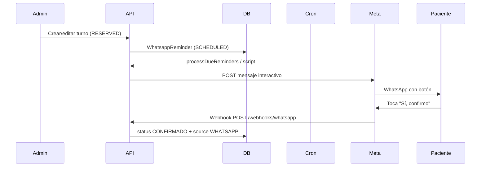

# Recordatorios y confirmación por WhatsApp (Meta Business)

## Objetivo

Enviar recordatorios automáticos a pacientes con turno en estado **Agendado** (`RESERVED`) y permitir confirmar con **un solo toque** en WhatsApp. Al confirmar, el turno pasa a **Confirmado** (`CONFIRMADO`) con origen `WHATSAPP`.

## Reglas de envío

| Situación | Comportamiento |
|-----------|----------------|
| Turno a **≥ 24 h** | Mensaje programado para **24 h antes** del inicio (`STANDARD_24H`). |
| Turno a **< 24 h** | **Confirmación inmediata** (`SHORT_NOTICE`): se envía unos minutos después de agendar (por defecto 5 min, configurable). Texto aclara que el turno es pronto y pide confirmar asistencia. |
| Sin teléfono del paciente | No se programa envío. |
| Turno ya pasó o en curso | No se programa / se omite al procesar. |
| Estado distinto de Agendado | Se cancelan recordatorios pendientes. |

## Mensaje al paciente

Incluye:

- Nombre del centro (`CLINIC_NAME`)
- Dirección (`CLINIC_ADDRESS` — hoy valor genérico, actualizar en `.env`)
- Nombre del paciente
- Fecha y horario
- Especialista
- Consultorio

**Un solo botón interactivo:** `Sí, confirmo` (Meta: mensaje tipo *button* con una reply).

Ejemplo (turno estándar):

```
Hola María, te recordamos tu turno en *LogoCen*:

📍 *LogoCen*
Av. Corrientes 1234, CABA

📅 martes 20 de mayo de 2026
🕐 10:00 a 11:00 hs
👨‍⚕️ Pérez, Juan
🏥 Consultorio 2

Tocá el botón para confirmar tu asistencia.

[ Sí, confirmo ]
```

Ejemplo (turno con menos de 24 h):

```
Hola María, tu turno en *LogoCen* es en menos de 24 horas.
Necesitamos que confirmes si vas a asistir.
...
```

## Flujo técnico



## Configuración Meta (resumen)

1. Cuenta **Meta Business** + app en [developers.facebook.com](https://developers.facebook.com).
2. Producto **WhatsApp** → número de prueba o producción.
3. Token de acceso y **Phone number ID**.
4. Webhook:
   - URL: `https://tu-dominio/webhooks/whatsapp`
   - Verify token: mismo valor que `WHATSAPP_VERIFY_TOKEN`
   - Suscripción: `messages`
5. `WHATSAPP_APP_SECRET` para validar firma `X-Hub-Signature-256`.

Variables en `backend/.env` (ver `.env.example`).

## Ejecución del cron

Cada **5–10 minutos** (recomendado):

```bash
# Opción A: script local / servidor
cd backend && npm run whatsapp:reminders

# Opción B: HTTP (con CRON_SECRET)
curl -X POST https://api.tudominio.com/api/internal/whatsapp/reminders/run \
  -H "X-Cron-Secret: tu-secreto"
```

## Archivos principales

| Ruta | Rol |
|------|-----|
| `backend/prisma/schema.prisma` | Modelo `WhatsappReminder` |
| `backend/src/whatsapp/reminderSchedule.ts` | Lógica 24 h vs corto plazo |
| `backend/src/whatsapp/messageBuilder.ts` | Texto y ID del botón |
| `backend/src/whatsapp/metaClient.ts` | Envío a Graph API |
| `backend/src/services/whatsappReminder.service.ts` | Programar, enviar, confirmar |
| `backend/src/services/whatsappWebhook.service.ts` | Webhook entrante |
| `backend/src/routes/whatsapp.webhook.routes.ts` | GET verify + POST eventos |

## Turnos fijos

La estructura soporta IDs `fixed:{seriesId}:{fecha}` en recordatorios y en la respuesta del botón. La programación automática al crear series fijas puede agregarse en una siguiente iteración (hoy: turnos puntuales al crear/editar cita).

## Próximos pasos sugeridos

1. Cargar dirección real en `CLINIC_ADDRESS`.
2. Validar teléfonos al alta/edición de pacientes (formato AR).
3. Panel admin: estado del recordatorio (enviado / fallido).
4. Plantilla aprobada por Meta si se requiere mensaje iniciado fuera de ventana 24 h (políticas de conversación).
5. Segundo canal opcional: aviso al admin si no confirma X h antes del turno.
